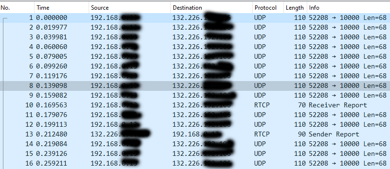

# Analysoi verkkoliikennettä

Aloitustunnin tehtäväksi annettiin verkkoliikenteen analysointi. Kauheasti tälläisestä ei ole vielä omalta kohdaltani kokemusta, mutta vinkkinä annettiin käyttää esimerkiksi Wireshark -ohjelmaa.

## Wireshark!

[Wireshark](https://www.wireshark.org/) on siis verkkoliikenteen analysointiohjelma, jolla voidaan tarkastella kaapattuja verkkopaketteja jo bittien tasolla. Käytännössä suositeltava käytettäväksi oman verkon tutkimiseen, mutta teoriassa ohjelmalla voisi kaapata paketteja muilta koneilta esimerkiksi vierasverkoissa -- tämä tosin ei ole suositeltavaa eettisellä ja laillisella tasolla.
  
  Tehtävää varten asensin Wiresharkin Windows 10 -koneelleni sivuston [https://www.wireshark.org/](https://www.wireshark.org/) kautta. Asennuksen jälkeen päästiin seuraavanlaiselle näkymälle:
  
  

Aloitettiin tässä vaiheessa liikenteen kaappaaminen omalta Ethernet portilta painamalla 'Ethernet' riviä (ethernet 3 ja 4 ovat virtualbox:n luomia virtual-interfaceja).

## Tulostetta ja analyysia

Annoin Wiresharkin pyöriä noin 3s, ja jo siltä ajalta tuli 239 riviä kaapattuja paketteja. En nyt ala koko tulostetta tuomaan tänne, mutta ruutukaappaus ainakin alun muutamasta ensimmäisestä rivistä:

Käydään vähän lävitse mitä tästä näkee jo. Ensimmäiset kaksi kenttää tulosteiden rivissä ovat aika yksiselitteiset -- monesko tulostettu rivi, ja timestamppi skannauksen aloittamisen jälkeen sekunneissa, jolloin paketti kaapattiin. **Source** on IP, josta paketti lähetettiin. **Destination** on IP-osoite, johon paketti lähetettiin. **Protocol** on protokolla, jonka alla paketti luotiin. **Length** olisi ainakin luultavasti ensisilmäyksellä datan määrä tavuina, jota paketista saatiin, mutto **info** kentässä teksti Len=68 viittaisi myös tähän, ja myöhemmässä vaiheessa paketin tarkempi tarkastelu myös paljasti itse tavujen määrän datakentässä olevan 68. Length-kentän numero saattaisi ehkä viittaa koko paketin kokoon otsikkokentät mukaanlukien, mutta tässä ajassa en sitä ehtinyt tarkemmin selvittää. **Info** kentässä näkyy myös suurimmassa osassa teksti "52208 -> 10000", joka viittaa portteihin, jota kautta paketti lähti (52208) ja johon pakettia tullaan ohjaamaan (10000).

Kuten tästä voi jo päätellä, koneeltani (Paikallinen IP-osoite 192.168.xxx.xxx) lähtee paljon dataa ulkoiselle IP-osoitteelle 132.226.xxx.xxx. Koska skannauksen aikana olin luentotunnilla yhteydessä Jitsi-puhe/videopalaveriin, todennäköisimmin tämä on kaikki dataa, joka ylläpitää yhteyttäni kokoushuoneeseen. Tätä hypoteesiani tukee myös pakettien käyttämä UDP-protokolla, jota yleisimmin käytetään VoIP- ja videopuheluissa. Vastaanotettua dataa tuolta kyseiseltä osoitteelta ei tuolla hetkellä pahemmin ollut Sender Reporttien lisäksi, johtuen todennäköisesti siitä, että juuri tuolloin kokoushuoneessa ei liikkunut puhetta eikä videota jota vastaanottaa. Todennäköisimmin kaappauksesta löytyisi enemmänkin 132* osoitteesta lähetettyä dataa, jos joku kokouksessa olisi juuri silloin ollut puhumassa.

ToDO: Tarkempi yksittäisen paketin tutkiminen
