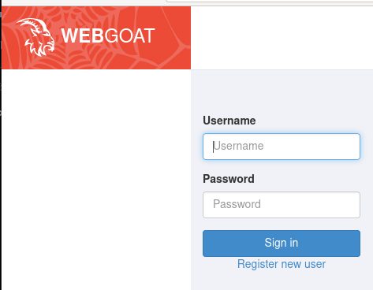
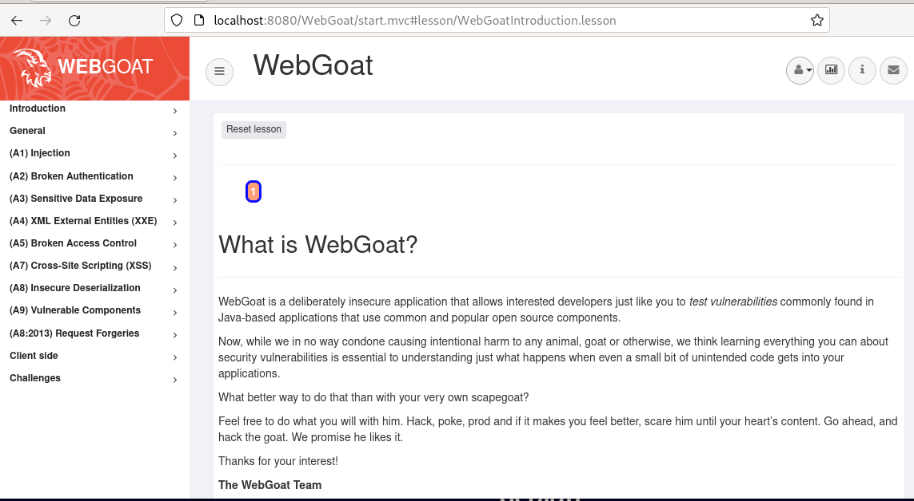
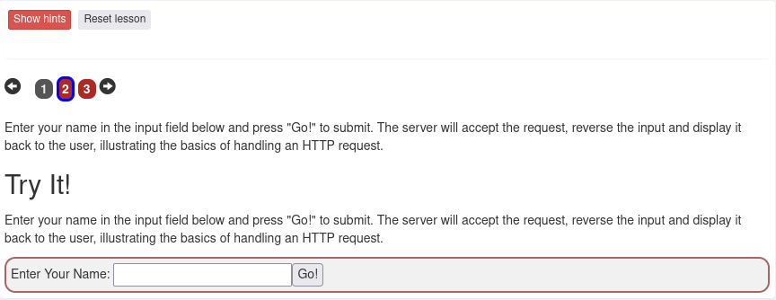
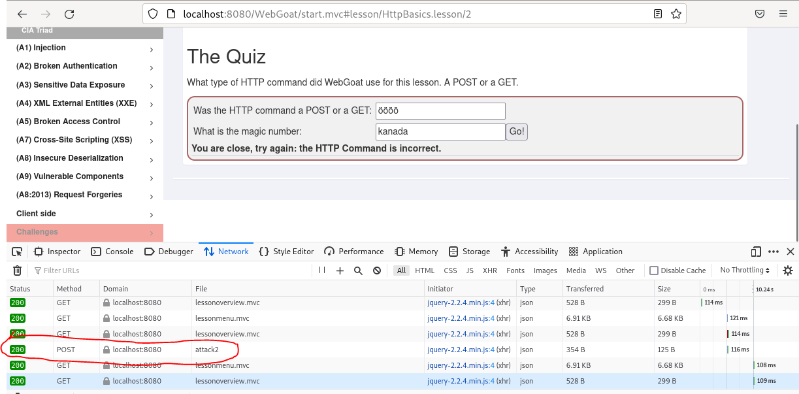
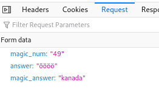
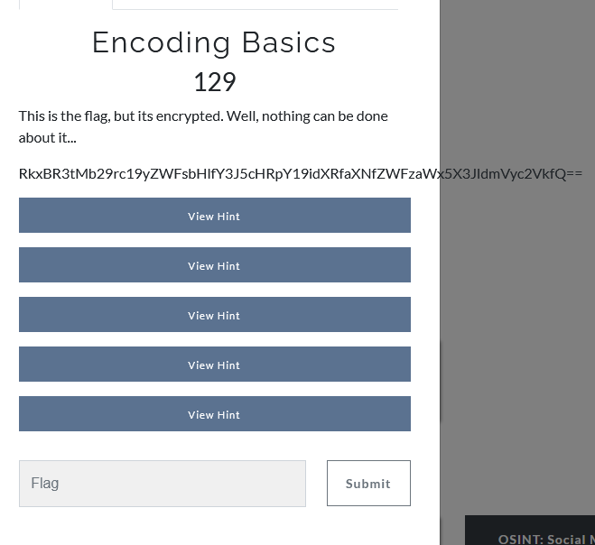

# A) Vuohikone

Ensimmäiseksi tehtäväksemme annettiin WebGoat:n asentaminen harjoitustyöskentelyä varten. Kyseisestä ohjelmistosta varoitettiin tosin, että se on aika haavoittuvainen, joten päätin asentaa sen kokonaan omalleen virtuaalikoneelle. Tätä varten pyöräytin Virtualboxille VM:n, jolle tulin asentamaan Debian 11 -linuxin.

Tämän Vuohiboxin luomisen sekä peruspäivityksien asentamisen (sudo apt-get update && sudo apt-get upgrade) jälkeen lähdettiin asentelemaan itse WebGoat 8:aa.

Tätä varten käytin Teron tarjoamia ohjeita (https://terokarvinen.com/2020/install-webgoat-web-pentest-practice-target/). Näitä ohjeita seuraten asennettiin muutama vaadittu/suositeltu ohjelmisto ensin:

``sudo apt-get -y install openjdk-11-jre ufw wget bash-completion``

Käynnistettiin tässä samalla juuri-asennettu palomuurisofta ( ``sudo ufw enable`` ) ja tämän jälkeen ladattiin Teron sivustolta WebGoat 8:n javapaketti:

``goat@GoatBox:~$ wget https://terokarvinen.com/2020/install-webgoat-web-pentest-practice-target/webgoat-server-8.0.0.M26.jar``

Ja ajetaan se java-komennolla:

``goat@GoatBox:~$ java -jar webgoat-server-8.0.0.M26.jar``

Tämän jälkeen tulee hirveä määrä java-konsolin tulostetta, mutta lopuksi tuli seuraava rivi, joka näytti kertovan Goat:n käynnistyneen oikein:

``org.owasp.webgoat.StartWebGoat         : Started StartWebGoat in 16.156 seconds (JVM running for 17.977)``

Huomautuksena tässä vaiheessa, että olin päättänyt myös eristää tämän VM:n kokonaan internetistä virtualbox:n asetuksista. WebGoatin kaikki sisälty kuitenkin pyörii VM:n pyörittämällä palvelimella, joten ulkoista verkkoyhteyttä se ei tarvitse sen käyttöön.

Syöttämällä verkkoselaimeen sisään osoitteen http://localhost:8080 (huomaa http- eikä https-yhteys!), pääsin sisäänkirjautumissivulle:

Rekisteröin tästä uuden käyttäjätunnuksen jakevuohi. Salasanaa en tietenkään kerro, vaikka epäiyksenä on, että se voi joidenkin webgoatin harjoitusten raportoinnin yhteydessä tullakkin ilmi -- tämän johdosta siis erityisen tärkeää, että salasanaa ei ole tullut käytettyä muualla!

Ja sisällä ollaan!

# B) Webgoatin alkutehtävät

Tarkoitus olisi käydä HTTPS Basics ja Developer Tools tehtävät Webgoatista sitten lävitse.

## HTTP Basics

HTTP Basics -tehtävässä ensimmäinen sivu oli teoriaa joka muistutti HTTP-transaktioiden toiminnasta. Seuraavalla sivulla kehotettiin syöttämään oma nimi alapuolella olevaan kenttää, HTTP-pyynnön toiminnan illustroimiseksi.

Seuraavalla sivulla tulikin pistokoe!

Varmaa tietoa tuosta sain palaamalla edelliselle sivulle, ja avaamalla Firefoxissa F12 napilla developer toolsit. Täällä networks välilehdelle tuli näkyviin seuraava rivi sen jälkeen, kun syötin nimeni uudestaan sivulle:

Eli tästä voisi päätellä, että oikea vastaus on POST -pyyntö... mutta mikäs tämä maaginen numero on?

Pienen mietinnän jälkeen päätin uteliaisuudesta syöttää kysymysikkunan molempiin kenttiin vain jotain satunnaista, DevTools tietenkin auki pitäen. Katsotaan ihan uteliaisuudesta mitä sieltä tulee network-ikkunaan...

Täälläkin tuli taas POST-rivi vastaan, mutta vieläkään ei näy mitään viitteitä maagiseen numeroon. Vähän turhautuneen klikkailun jälkeen tajusinkin, että saan näitä pyöntörivejä avattua tarkempaa tutkintaa varten.

Täältä löytyi kaikennäköistä hauskaa otsikkotietoa, mutta ei kuitenkaan kauhean hyödyllistä tässä. Mutta mitäs Request-välilehdeltä löytyikään:

Syötettiin sitten näiden paljastusten perusteella POST ja 49.

## Developer Tools

Odotettavasti tämänkin tehtävän alussa oli teoriaa ja infoa DevToolsin käytöstä... joka sinänhä ehkä vähän hassua, koska juuri itsekkin niitä käytin. No ihan miten vaan. Ensimmäinen sivu kertoo myös Chromen DevToolsista, mutta itse käytän firefoxia tällä VM:lläkin, mutta ei huolestuta nyt siitä...

2-sivulla käytiin hieman element-inspectorin toimintaa, ja miten html- ja css-elementit tulevat näkyviin sen kanssa (ja miten niitä voidaan editoida!). Kolmannella sivulla kehotettiin tarkistelemaan konsoli-välilehteä, tyhjentämään se (ohjeet oli ctrl + L, mutta firefoxissa se onkin ctrl + shift + L). Konsoliin voi siis syöttää javascript-koodia.

Nelossivulla päästiin tehtävää ratkottavaksi konsoli-ikkunan hyödyntämisen kanssa:

Syötin tehtäväkehotteen antavan funktion konsoliin, ja sieltä saatiin satunnaisena numerona -147061554 (huhhuh...) jolla päästiin jatkamaan tehtävää eteenpäin.

Sivu 5 käsitteli Lähteiden tutkimista. Tämä Chromessa tehtäisiin näemmä helposti jo näkyvillä olevan source-välilähden kautta, mutta Firefoxissa se olikin näemmä Debugger-välilehden alla -- ja sieltä sitten pääsi tutkimaan kaikki yksittäisi html- tai css- tai js tiedostoja ja niiden sisältävää koodia. Samalla sivulla käytiin lävitse Network-välilehteä, jota tosiaan hyödynsinkin jo HTTP Basics -tehtävässä.

Lopuksi tuli tehtäväksi napata network-välilehdeltä HTTP -pyyntö ja hakea sen sisältä generoitu numero.

Tämähän kuulostaa hirveän tutulta jostain syystä...

Joka tapauksessa, vastauksen tehtävään sain "GO!" painikkeen painamisen jälkeen avaamalla POST-pyynnön Network-ikkunasta joka tuli generoitua, ja sen syvemmältä tutkinnalta saatiin randomisoitu numero Requests-välilehden alta.

# C) Bandit

Seuraavana tehtävänä on läpäistä Over The Wire -sivuston Bandit -pelin tasot 0-2. Tämä lähtee siis käyntiin sivulta (https://overthewire.org/wargames/bandit/bandit0.html).

## Taso 0

Bandit-pelissä siis edetään kirjautumalla OverTheWire:n ylläpitämälle palvelimille seuraten sivustolta löytyviä ohjeita. Tasolla 0 ohjeistetaankin nyt kirjautumaan heidän palvelimelle SSH-yhteydellä, ja sen teen komentorivillä seuraavalla komennolla:

``ssh bandit.labs.overthewire.org -p 2220 -l bandit0``

Syötettyäni sivustolla annetun salasanan, olen palvelimella sisällä. Tämän jälkeen sivu kertoo, että salasana seuraavalle tasolle on kirjoitettu tiedostoon nimeltä nimeltä readme, koti-hakemistossa. Oletuksena kirjautumisen jälkeen päästään muutenkin käyttäjän kotikansioon aktiiviseksi, mutta tarkistin tiedoston olemassaolevuuden ``ls`` komennolla ensin kuitenkin, ja sen jälkeen käytin komentoa ``cat readme`` tarkistamaan sen sisällön, ja tuolta sainkin sitten salasanan.

Tätä salasanaa hyödyntäen kirjauduin bandit1 -käyttäjälle samalla palvelimella, ja taso oli sillä läpäisty!

## Taso 1

Taso 1:n sivu kertoo seuraavan tason salasanan löytyvän tiedostosta kotihakemistossa, jonka nimenä on vain -. Normaalisti "-" merkkiä käytetään komennoissa parametrien määrittämiseen, joten pelkkä ``cat -`` antaisi virheen. Hyödynnetään tässä siis polkua komennossa, jotta komentorivi tunnistaa tiedoston: ``cat ./-``

Tällä saatiin salasana seuraavalle tasolle!

## Taso 2

Tällä tasolla salasanan kerrotaan löytyvän tiedostosta nimeltä **spaces in this filename**. Välimerkit rikkovat luonnollisesti tiedostonimiä komentorivillä ellei käytä heittomerkkejä. Tämä huomioonottaen saadaan seuraavan tason salasana komennolla ``cat "spaces in this filename"``

# D) Kali Linux

Seuraavaksi asennetaan Kali Linux virtuaalikoneelle. Tähän päätin hyödyntää kalin jo tarjoamaa virtualboxille tehtyä valmiin asennuksen imagea, joka löytyi Kali:n sivustolta: (https://www.kali.org/get-kali/#kali-virtual-machines).

Tiedoston lataamisen jälkeen, virtualboxin Tools -välilehden alta valitsin vaihtoehdon "Add", jolla pääsin hakemaan ladatun tiedoston, ja Virtualbox automaattisesti importoi sen käyttöön. Tälläisenään VM:stä löytyy vain 2GB:n verran muistia, joten päätin nostaa sen 8GB:lle. Tämän lisäksi boottasin koneen vielä nopeasti, jotta pääsin muuttamaan oletustunnuksen ja salasanan.

# E) Generation Z Hack Challenge

Seuraavaksi tehtävänä ratkaista yksi tehtävä challenge.fi -sivustolta. Tehtävänahto antoi esimerkkinä vuodelta 2021 tehtävän ** Encoding Basics** ja koska en ole kauhean luovalla päällä...

Tässä vaiheessa täytyy myöntää, että en näin tyhjältä päässytkään eteenpäin, joten kokeilin päästä avaamaan sivun antamia vihjeitä. Jokin sivuston javaskriptissä tosin näyttäisi olevan viallinen, koska en saanut mitään niistä auki, ja kokeilun vuoksi pistin jotain satunnaista myös vastauskenttään ja painon 'submit' nappumaa... eikä mitään tapahtunut.

No enpä ainakaan pääse tarkistamaan saanko mitään tehtävää oikein. Muistin tässä vaiheessa kuitenkin jonkun joskus maininneen (ehkä oppitunnilla?), että jos avain loppuu merkkeihin "==", se kertoo ainakin jotain salauksesta. Nopea google-haku vei minut StackOverflow -keskustelun luokse, josta selvisi kyseessä olevan base64 salaus. (https://stackoverflow.com/questions/34211497/what-all-encryption-uses-in-the-last)

Lisätutkiminen paljasti myös, että Base64 ei edes ole kunnollinen salausmenetelmä, ja sen voi kääntää selkokieliseksi suoraan linuxin komentoriviltä! (https://www.serverlab.ca/tutorials/linux/administration-linux/how-to-base64-encode-and-decode-from-command-line/)

Avasin jälleen Debian VM:n Kali:n sijasta havainnolistaakseni kuinka tämän koodin saa käännettyä suoraan vain echo -komennolla ja bashissa jo valmiiksi olevalla base64 lisäkomennolla, jaa täällä syötin komentoriviin seuraavan:

``echo -n RkxBR3tMb29rc19yZWFsbHlfY3J5cHRpY19idXRfaXNfZWFzaWx5X3JldmVyc2VkfQ== | base64 --decode``

Kokeilin tuon vielä syöttää taas tuonne sivustolle, mutta ei se toiminut. No minkäs teet. Olen ainakin tyytyväinen tähän suoritukseen, sillä kuitenkin sain tuon selvästi avattua. ¯\_(ツ)_/¯
